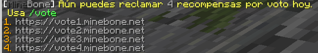

---
authors:
  - fpalomo
categories:
  - survival
---
# Cajas de loot
Contamos con varias cajas las cuales dan loot aleatorio basado en probabilidades, todas nuestras cajas pueden abrirse tanto por huesitos como por dinero real a excepción de la caja de votos la cual solo puede abrirse con llaves obtenidas al votar.

Puedes consultar el loot y probabilidades de cualquier caja con solo dar click izquierdo a la caja en el juego.

## Caja de votos
Cada día puedes usar el comando `/vote` para obtener hasta un máximo de 5 llaves para esta caja, no pueden obtenerse de ninguna otra forma y todo el mundo puede obtener la misma cantidad de llaves, independientemente de su rango.

Cuando votes en 40servidoresmc.es (vote1.minebone.net), puedes usar el comando `/vote40` para obtener una llave adicional, debería ejecutarse automáticamente pero a veces falla por lo que debes tenerlo en cuenta.

## Caja de armaduras y caja de herramientas
Estas dos cajas pueden abrirse tanto a cambio de 1000 huesitos como usando una llave, las llaves se consiguen en [la tienda](https://tienda.minebone.net)