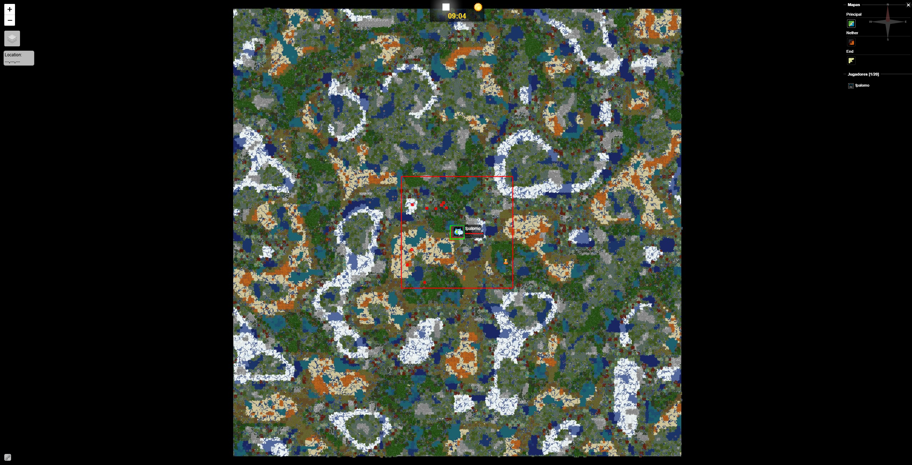
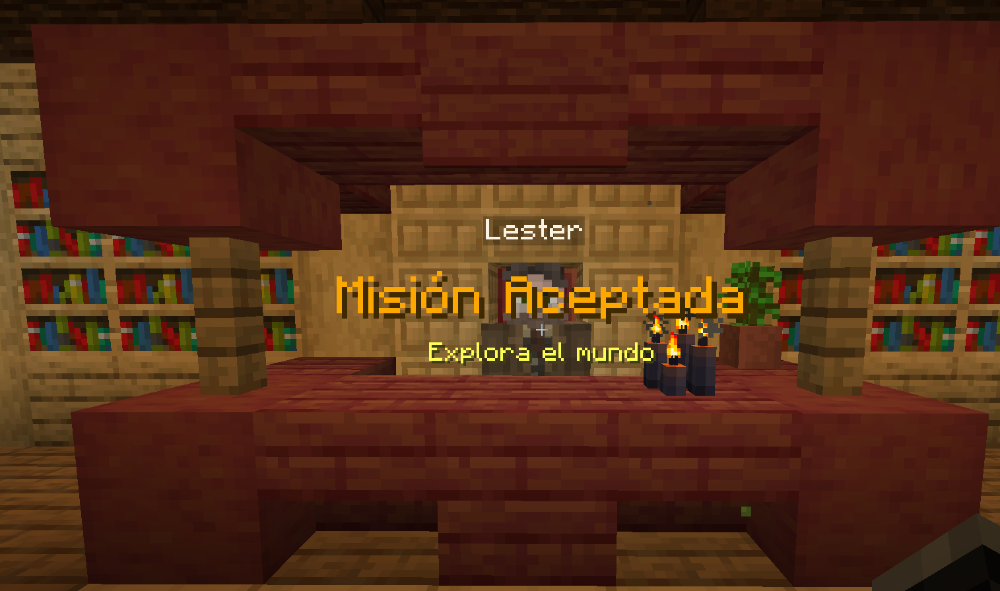
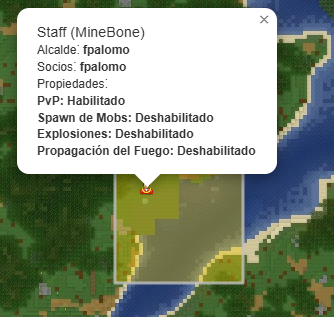

---
authors:
  - fpalomo
categories:
  - survival
---
# Mapa de Survival
Nuestro mapa usa un generador de mundos personalizado para que tengais una experiencia única, el tamaño del mapa está bloqueado en 20.000 x 20.000 bloques. Contamos con un mapa web el cual permite navegar con mayor facilidad: https://mapa-survival.minebone.net

## Jugadores
En el mapa se puede ver la posición, vida y hambre de los jugadores (hay unos segundos de delay entre los datos reales y lo que se muestra en el mapa), los jugadores con rango BONE y BONE+ pueden elegir si quieren aparecer o no en el mapa usando el comando `/dynmap hide` y `/dynmap show`

## Zona protegidas
Las zonas con protección (como por ejemplo el spawn), se muestran en color rojo con borde verde

## Mundos
Por defecto, el mapa se abre mostrando el conocido como "overworld" pero usando la barra lateral que se encuentra a la derecha se pueden ver los mapas para el nether y el end, estos mapas NO están pregenerados y se irán generando a medida que los jugadores descubran nuevo territorio.

## Borde del mundo
En el mapa web se puede observar un cuadrado con borde rojo el cual indica donde están los límites del mapa, este límite no es fijo y puede expandirse durante eventos especiales o completando la misión incial "Explora el mundo"

Por cada jugador que complete la misión, se expandirá el borde del mundo 100 bloques en cada dirección.

## Ciudades
El mapa web también muestra las ciudades que hay en el servidor, dar click en una ciudad nos muestra información adicional sobre la misma.
